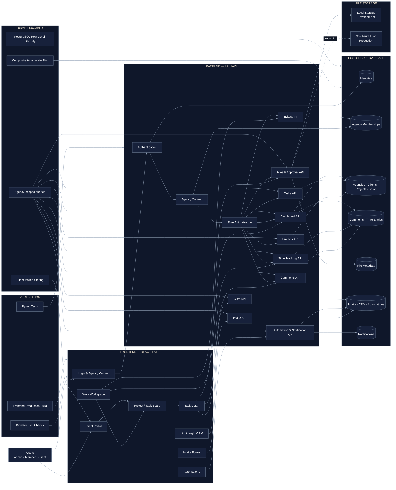

# AgencyDesk architecture diagram

## Presentation summary

The frontend sends requests to FastAPI. FastAPI resolves the identity, role, and active agency context before applying authorization and tenant-scoped filters. Client visibility is enforced for tasks, comments, files, and dashboards. Composite foreign keys and PostgreSQL Row-Level Security provide database-level tenant protection. Files use local storage in development and can move to S3 or Azure Blob Storage in production.
